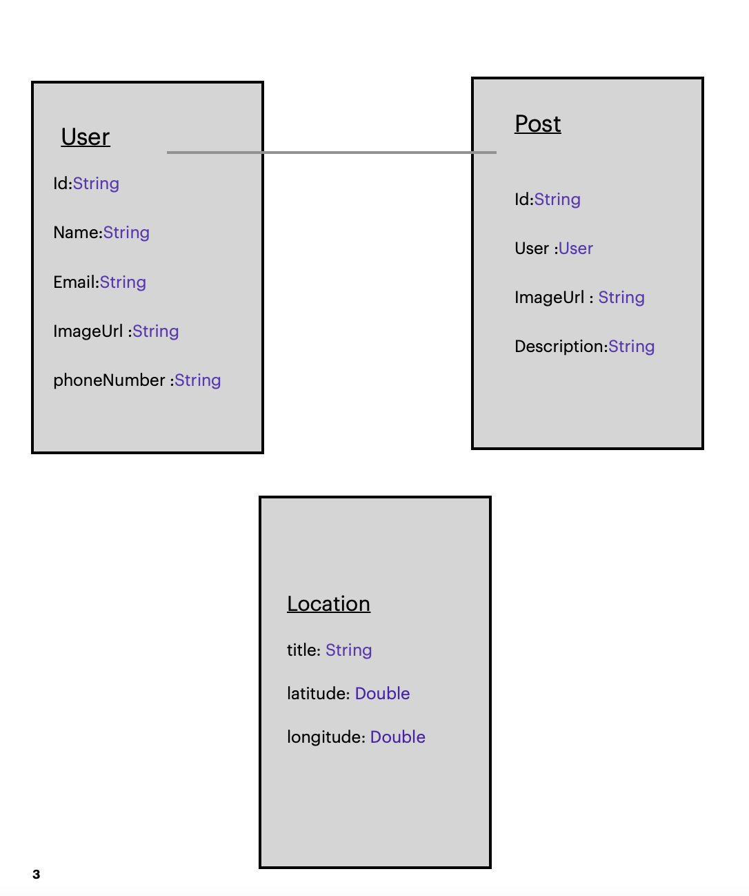

# CarFix

## CarFix
 Final Project .
 
 It is an application that acts as a link between the engineer approved by the company and the customer. That is, when you experience any malfunction in the car, you can, through the application, request assistance from the engineer and come to you to solve the problem …

## Demo

## User Stories

As user can create account 
As user can log in
As user can Service Request  
(Describe the problem and take a picture )
As user can show car fix in domain
As engineer can log in
As engineer can accept or decline the request

## Framework

- UIKit
- Firebase
- Mapkit
- CoreLocation
- IQKeyboardManagerSwift
- NVActivityIndicatorView

## ERD 

## WireFrame

